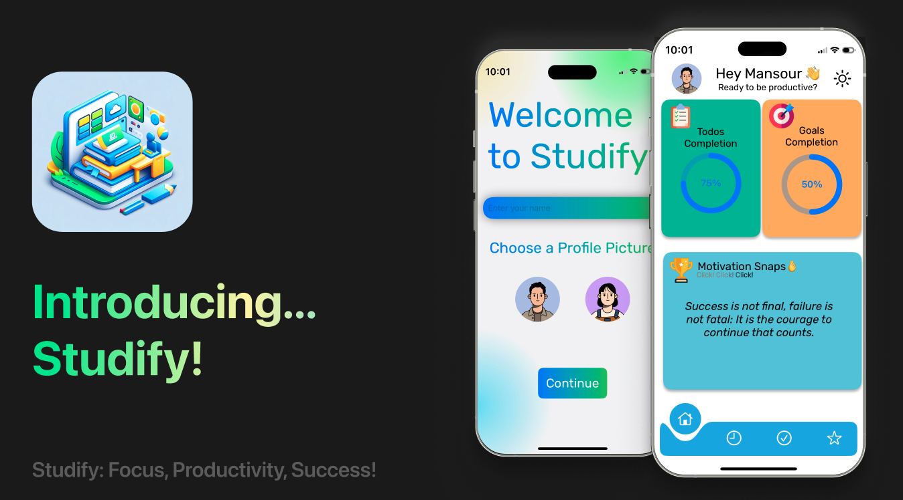

  <h1>Studify</h1>

  

  <h1>What does Studify offer to students?</h1>
  

    Studify is an all-encompassing application designed to significantly enhance students' productivity and academic success. It combines timers, featuring popular study techniques, with an easy-to-use interface that includes robust task management and goal-setting capabilities. Essentially, Studify is a versatile tool that addresses various challenges students encounter in their academic journey, providing a single platform for organization, focus, and motivation.

  <h1>Why is Studify a must-have for students?</h1>
  

    Studify is essential for students as it serves as a holistic companion in their academic pursuits. It stands out by seamlessly integrating effective study techniques, user-friendly interfaces, and goal-setting functionalities. With Studify, students can not only stay organized and maintain focus but also find the motivation needed to navigate the demands of university and school life successfully. It empowers students by giving them the tools necessary to take control of their academic responsibilities in one cohesive and user-friendly application.

  <h1>How does Studify revolutionize time management?</h1>
  

    Studify revolutionizes time management by introducing an innovative timer feature. Through the incorporation of popular study techniques, Studify ensures that study sessions are both productive and sustainable. The adaptable timers prevent burnout and promote a balanced study routine, offering students the flexibility to optimize their study sessions based on their unique learning styles and preferences. Studify's commitment to redefining time management lies in providing students with a flexible tool to enhance their study sessions effectively.

  <h1>What makes Studify stand out in task management?</h1>
  

    Studify stands out in task management by offering an intuitive interface that seamlessly integrates a to-do list and long-term goals. This dual functionality provides students with a powerful tool to organize their daily tasks while setting meaningful milestones for both short-term and long-term success. Studify's approach to task management is about creating a strategic roadmap that aligns with students' broader academic aspirations. It goes beyond a mere checklist, empowering students to efficiently organize their academic workload.

  <h1>How does Studify pave the way for lasting academic success?</h1>
  

    Studify becomes an indispensable tool for lasting academic success by fostering a proactive and goal-oriented mindset. The long-term goals feature, complemented by detailed subtasks, empowers students to envision and work towards achieving their overarching objectives. By breaking down larger aspirations into manageable steps, Studify ensures that students have a clear roadmap for success throughout their educational journey. This strategic approach significantly contributes to long-term academic accomplishments by helping students stay focused and motivated in their pursuit of academic excellence.

